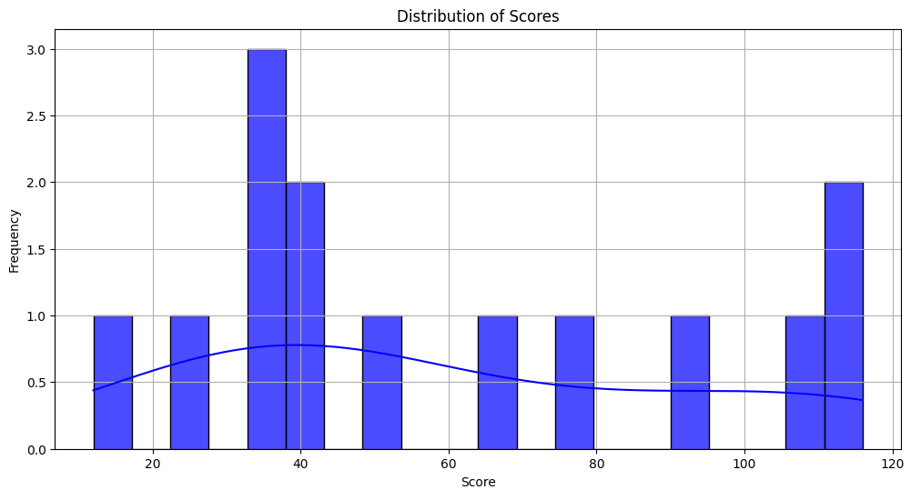
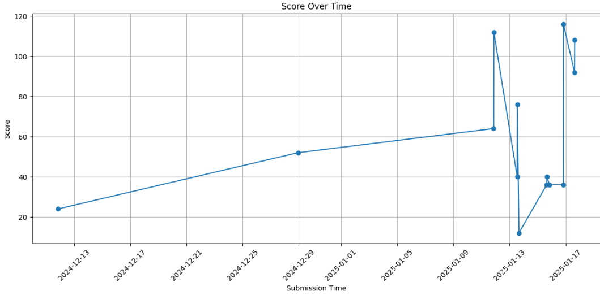
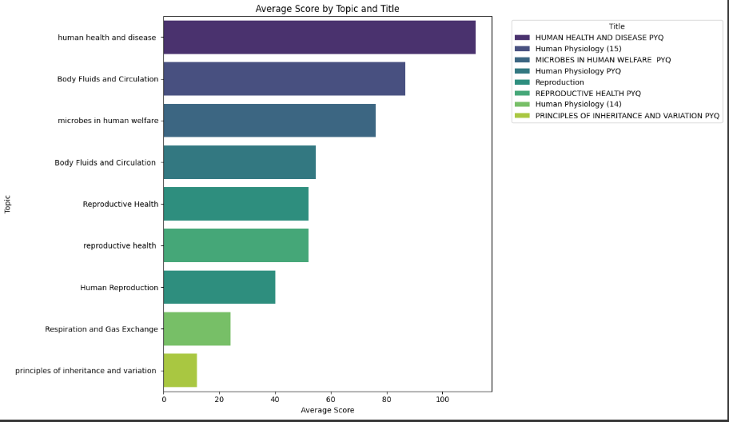

# README for Analysis.ipynb

## Overview
This Jupyter Notebook, titled **Analysis.ipynb**, is designed to perform data analysis related to various topics in biology and health. It includes a dataset that captures quiz scores across different subjects, allowing for insights into performance trends and educational outcomes.

## Contents
The notebook contains the following key sections:

1. **Introduction**
   - Brief description of the dataset and its relevance.
   
2. **Data Loading**
   - Code to import necessary libraries and load the dataset.

3. **Data Exploration**
   - Initial exploration of the data structure, including:
     - Summary statistics
     - Data types
     - Missing values

4. **Data Visualization**
   - Visual representations of quiz scores by topic to identify patterns and trends.
   - **Screenshots of Graphs**:
     - Quiz Scores by Topic
     - Performance Trends

5. **Statistical Analysis**
   - Application of statistical methods to analyze the performance across different subjects.

6. **API Guide**
   - Instructions on how to set up and run the API using Docker.

7. **Conclusion**
   - Summary of findings and potential implications for educational strategies.

## Dataset
The dataset includes the following columns:
- **quiz.topic**: The subject of the quiz (e.g., Body Fluids and Circulation, Human Reproduction).
- **score**: The score achieved by students in each quiz.
  - distribution of scores
  - score over time
  - topic & title
 - 
  - 
  -  
### Sample Data
| quiz.topic                               | score |
|------------------------------------------|-------|
| Body Fluids and Circulation              | 108   |
| Body Fluids and Circulation              | 92    |
| Body Fluids and Circulation              | 116   |
| Body Fluids and Circulation              | 36    |
| Body Fluids and Circulation              | 36    |
| Human Reproduction                       | 40    |
| Body Fluids and Circulation              | 36    |
| Principles of Inheritance and Variation  | 12    |
| Microbes in Human Welfare                | 76    |
| Reproductive Health                      | 40    |
| Human Health and Disease                 | 112   |
| Reproductive Health                      | 64    |
| Reproductive Health                      | 52    |
| Respiration and Gas Exchange             | 24    |

## Requirements
To run this notebook, ensure you have the following Python packages installed:
- Jupyter Notebook
- Pandas
- Matplotlib
- Seaborn
- NumPy

You can install these packages using pip:

```bash
pip install jupyter pandas matplotlib seaborn numpy
```

## API Guide

### Docker Setup

To run the FastAPI application using Docker, follow these steps:

1. Create a `Dockerfile`.
2. Create `main.py`.
3. Create `requirements.txt`.
4. Build your Docker image:

   ```bash
   docker build -t fastapi-quiz-analyzer .
   ```

5. Run your Docker container:

   ```bash
   docker run -p 8000:8000 fastapi-quiz-analyzer
   ```

6. Accessing the API:
   - Once your container is running, you can access the API at `http://localhost:8000`.
   - To analyze quiz data, use the following command:

     ```bash
     curl -X POST http://127.0.0.1:8000/analyze_quiz
     ```
[Click here to watch the video](api_guide.mp4)
## License
This project is licensed under the MIT License - see the LICENSE file for details.

## Acknowledgments
Thanks to all contributors who helped in developing this analysis framework.

Citations:
[1] https://ppl-ai-file-upload.s3.amazonaws.com/web/direct-files/50605726/363f2896-e22a-4c35-9ddf-160c4d446788/Analysis.ipynb
